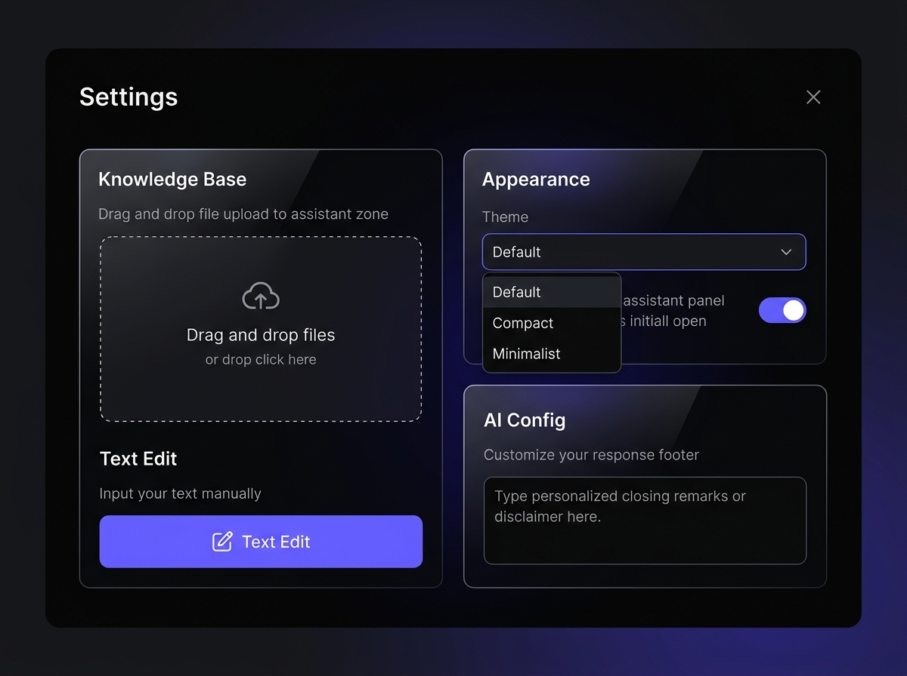

# Предложение по редизайну панели настроек (Bento Grid)

Мы предлагаем структурировать настройки во вкладке «Настройки» в виде Bento Grid (сетки карточек). Это позволит логически разделить настройки, сделав их более структурированными и удобными для сканирования глазами.

## Визуальный макет настроек

---

## Предлагаемые разделы настроек

### 1. 📂 База знаний (Knowledge Base)
Левая (большая) колонка. Содержит все операции, связанные с контентом:
* Выбор режима (Файл / Текстовый редактор).
* Драг-н-дроп зона для загрузки файлов `.md`/`.txt`.
* Отображение загруженного файла.
* Кнопка «Скачать базу знаний».

### 2. 🎨 Оформление (Appearance)
Правая верхняя карточка. Управляет визуальной темой и стартовым состоянием:
* Выпадающий список тем оформления (Glass, Linear, Apple, Dune).
* Переключатель «Изначально открыто» (минимизированный или раскрытый вид виджета по умолчанию).

### 3. ⚙️ Конфигурация ответов (AI Config)
Правая нижняя карточка. Управляет поведением вывода ИИ-ассистента:
* Текстовое поле ввода для подписи («Добавляем в конец ответа»). В будущем сюда можно добавить настройки температуры или кастомного промпта.

---

## План реализации в кодовой базе

1. **HTML ([index.html](file:///Users/eugene/MyProjects/easyFAQ.online/index.html)):**
   * Обернем содержимое `#settingsTab` в контейнер с классом `.settings-grid`.
   * Создадим три блока-карточки `.settings-card` (или `.bento-card`): `.card-kb`, `.card-appearance`, `.card-ai`.
   * Распределим существующие инпуты и кнопки по этим карточкам.

2. **CSS ([style.css](file:///Users/eugene/MyProjects/easyFAQ.online/style.css)):**
   * Добавим стили для сетки `.settings-grid` с использованием CSS Grid (`grid-template-columns: 1.2fr 1fr;` на десктопе и в 1 колонку на мобильных).
   * Зададим `.settings-card` скругленные углы, границы в стиле Linear, легкий полупрозрачный фон (Glassmorphism) и отступы.
   * Выровняем элементы управления внутри карточек, сделав их более пропорциональными.

---

> [!NOTE]
> Все текущие обработчики событий JS, ID элементов и логика сохранения настроек останутся прежними, изменится исключительно HTML-структура и CSS-стилизация. Это гарантирует 100% стабильность работы бэкенда и сохранения данных.
